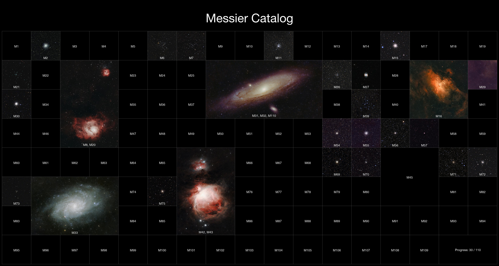
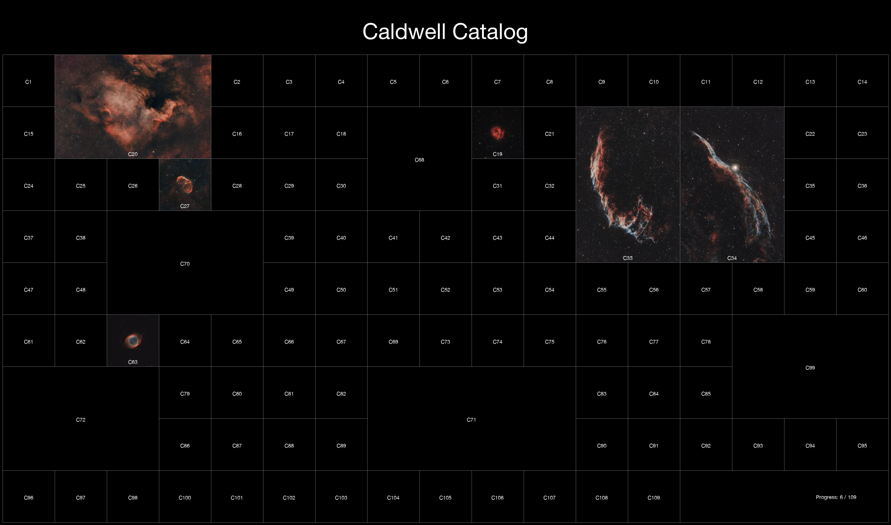

# Astro Catalog

This project generates a mosaic of Messier or Caldwell objects, using images from a local folder.  
The script arranges the objects into a configurable grid, supports larger slots for extended targets (e.g. Andromeda), and overlays labels and a title.  

Perfect for creating a large-format print.

---

## Features

- Loads Messier or Caldwell object images from a folder (`M31.jpg`, `M-31.png`, `M_31.tif`, etc.)
- Places objects on a grid with configurable **layout**
- Supports **multi-cell slots** for large objects (e.g. M31, M42, M45)
- Supports grouping **multiple objects** in one slot for objects close to each other (e.g. M42 and M43, M31 and M32)
- Adds a **title** and **progress counter** if it's not completed yet
- Draws **labels** on images and placeholders for missing ones
- Adjustable size of the final image
- Saves as JPEG, PNG or TIFF

---

## Example

Here’s a couple of in-progress examples:

---

## Installation

1. Download the latest release:

https://github.com/sylvainvillet/astro-catalog/releases

2. Unzip it

3. Run astro-catalog. First loading can take a little bit of time, be patient :-)

4. Depending on the OS, you might have a security warning to clear
   
---

## Usage

The UI should be pretty straightforward. Select the catalog (Messier or Caldwell) and select the folder containing your images.

Your images in the selected folder must start by one letter (M for Messier, C for Caldwell) and then the object number like these examples:

* `M31_final.jpg`
* `M-42.png`
* `C 45.jpeg`
* `C_66_123x60s.png`

If you want to adjust the framing, you can crop your images with Photoshop, Gimp or other before running the program. Use an aspect ratio that matches the grid spot (1:1 for squares, 3:2, 2:1, etc for bigger objects) for precise framing.

Adjust the scale depending on how big you want the final image. Use a smaller scale for sharing on social networks and a bigger scale for printing.

You can choose the output file format by using PNG, JPEG or TIFF extension when saving the image.
