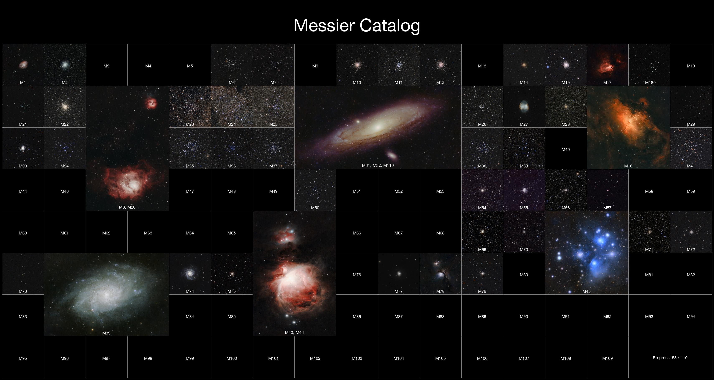
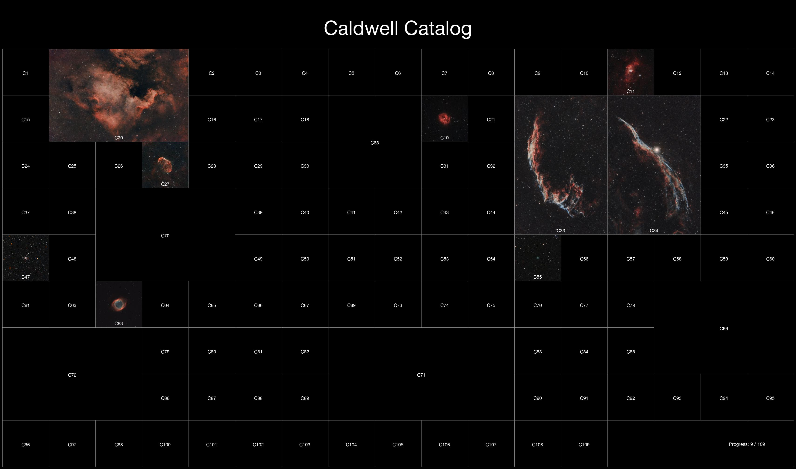

# Astro Catalog

This project generates a mosaic of Messier or Caldwell objects, using images from a local folder.  
The script arranges the objects into a configurable grid, supports larger slots for extended targets (e.g. Andromeda), and overlays labels and a title.  

Perfect for creating a large-format print.

---

## Features

- Loads Messier or Caldwell object images from a folder (`M31.jpg`, `M-31.png`, `M_31.tif`, etc.)
- Places objects on a grid with configurable **columns**, **thumbnail size**, and **layout overrides**
- Supports **multi-cell slots** for large objects (e.g. M31, M42, M45)
- Supports grouping **multiple objects** in one slot for objects close to each other (e.g. M42 and M43, M31 and M32)
- Adds a **title** and **progress counter** if it's not completed yet
- Draws **labels** on images and placeholders for missing ones
- Adjustable **padding** around the mosaic
- Saves as JPEG, PNG or TIFF

---

## Example

Here’s a couple of in-progress examples:

---

## Installation

1. Download the latest release:

https://github.com/sylvainvillet/astro-catalog/releases

2. Unzip it

3. Run astro-catalog
   
---

## Usage

The UI should be pretty straightforward. Select the catalog (Messier or Caldwell), select the folder containing your images and set the output file.
You can choose the output file format by using PNG, JPEG or TIFF extension.

Adjust the scale depending on how big you want the final image. Use a smaller scale for sharing on social networks and a bigger scale for printing.

Your images in the selected folder must start by one letter (M for Messier, C for Caldwell) and then the object number like these examples:

* `M31_final.jpg`
* `M-42.png`
* `C 45.jpeg`
* `C_66_123x60s.png`

Then click Generate and the image will be saved at the specified path and opened in the default image viewer.

You can crop your images with Photoshop, Gimp or other before running the script. Use an aspect ratio that matches the grid spot (1:1 for squares, 3:2, 2:1, etc...)
