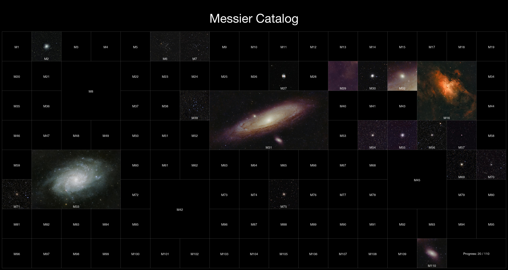
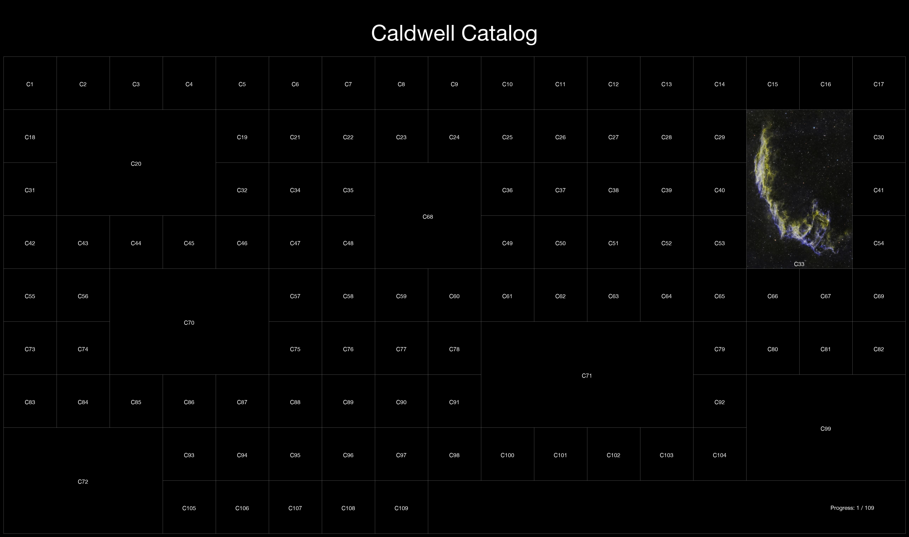

# Astro Catalog

This project generates a mosaic of Messier or Caldwell objects, using images from a local folder.  
The script arranges the objects into a configurable grid, supports larger slots for extended targets (e.g. Andromeda), and overlays labels and a title.  

Perfect for creating a large-format print.

---

## Features

- Loads Messier or Caldwell object images from a folder (`M31.jpg`, `M-31.png`, `M_31.tif`, etc.)
- Places objects on a grid with configurable **columns**, **thumbnail size**, and **layout overrides**
- Supports **multi-cell slots** for large objects (e.g. M31, M42, M45)
- Adds a **title** and **progress counter** if it's not completed yet
- Draws **labels** on images and placeholders for missing ones
- Adjustable **padding** around the mosaic
- Saves as JPEG (default), PNG or TIF

---

## Example

Here’s a couple of in-progress examples:




---

## Installation

1. Install **Python 3**:

https://www.python.org/downloads/

2. Open a terminal and install **Pillow**:

```bash
pip install pillow
````

3. Clone or Download the project (Code -> Download ZIP)
   
---

## Usage

Copy your images to the `messier_images/` or `caldwell_images/` folders and ensure they start by one letter (M for Messier, C for Caldwell) and then the number like these examples:

* `M31.jpg`
* `M-42.png`
* `C 45.jpeg`
* `C_66_123x60s.tif`

Then open a terminal and run:

```bash
python3 messier-catalog.py
```

or

```bash
python3 caldwell-catalog.py
```

---

## Special Layout for Bigger Targets

Some objects span much larger areas in the sky, so they are given multiple grid cells in the mosaic to better reflect their size:

| Messier | Object               | Grid Position (col, row) | Span (cols × rows) |
|---------|----------------------|---------------------------|--------------------|
| M8      | Lagoon Nebula        | (2, 1)                    | 2 × 2              |
| M16     | Eagle Nebula         | (14, 1)                   | 2 × 2              |
| M31     | Andromeda Galaxy     | (7, 2)                    | 4 × 2              |
| M33     | Triangulum Galaxy    | (1, 4)                    | 3 × 2              |
| M42     | Orion Nebula         | (5, 5)                    | 2 × 2              |
| M45     | Pleiades             | (13, 4)                   | 2 × 2              |

All other objects default to **1 × 1** cells and are auto-placed.

You can customize this layout in `messier-catalog.py` inside the `messier_layout` dictionary, as well as their Caldwell counterparts.

---

## Command-line options

All options have defaults but can be overridden:

```bash
python3 messier-catalog.py --input-folder my_images --output-file mosaic.jpg --grid-cols 20
```

Available arguments:

| Option              | Default                                       | Description                            |
| ------------------- | ----------------------------------------------| -------------------------------------- |
| `--input-folder`    | `messier_images` or `caldwell_images`         | Folder containing Messier images       |
| `--output-file`     | `messier_mosaic.jpg` or `caldwell_mosaic.jpg` | Output file path                       |
| `--title`           | `Messier Catalog` or `Caldwell Catalog`       | Title                                  |
| `--grid-cols`       | `17`                                          | Number of columns in the grid          |
| `--thumb-size`      | `300`                                         | Thumbnail size (pixels)                |
| `--font-path`       | `/System/Library/Fonts/HelveticaNeue.ttc`     | Path to font file                      |
| `--font-size`       | `32`                                          | Font size for labels and placeholders  |
| `--title-font-size` | `124`                                         | Font size for the title                |
| `--padding`         | `20`                                          | Padding around the entire mosaic       |

---

## Example

```bash
python3 messier-catalog.py --grid-cols 20 --thumb-size 400 --output-file messier_large.png
```

This creates a high-quality PNG 20-column mosaic with larger cells and saves it as `messier_large.png`.
Increasing or reducing the number of columns can lead to bigger targets getting out of the grid, if this happens, adjust their position as described above.

---

## FAQ

- How do I adjust the framing of the pictures?

You can crop your images with Photoshop, Gimp or other before running the script. Use an aspect ratio that matches the grid spot (1:1 for squares, 3:2, 2:1, etc...)

- How do I generate a Messier catalog on a 11x10 grid, with the same size for all the images?

Edit the `messier_layout` in the file `messier-catalog.py` to remove all the rows like this:

`messier_layout = {}`

And then run the script with 11 as grid-cols argument:

```bash
python3 messier-catalog.py --grid-cols 11
```

- How can I get a big resolution for printing it?

Increase the "thumb-size" value which is the resolution of each small square. Default value is 300 but you can use any value, the total width of the image will be `thumb-size * grid_cols + 2 * padding`.

Also use a lossless compression like PNG or TIF:

```bash
python3 messier-catalog.py --thumb-size 600 --output-file mosaic.png
```
